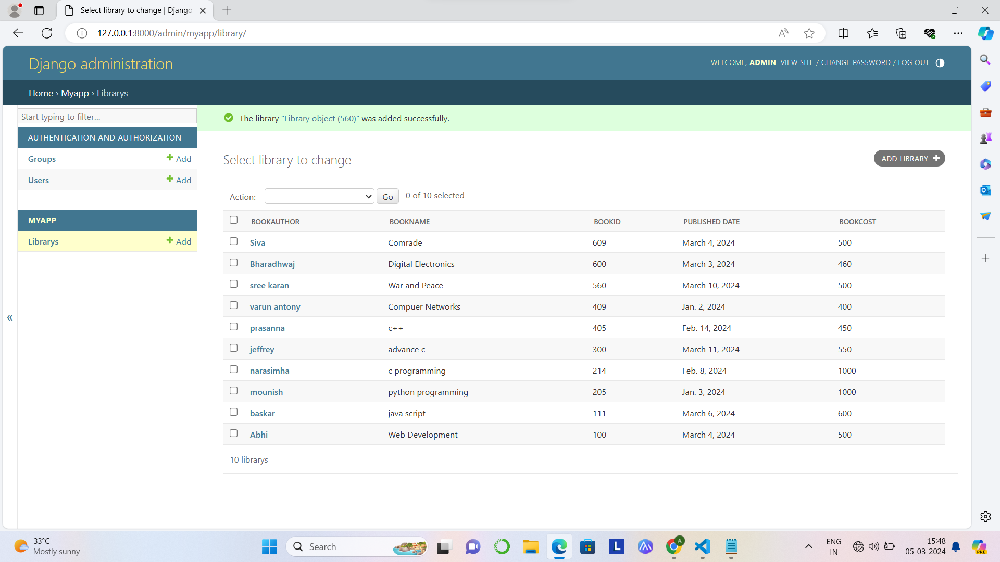

# Ex02 Django ORM Web Application
## Date: 03.03.24

## AIM
To develop a Django application to store and retrieve data from a Book database using Object Relational Mapping(ORM).

## Entity Relationship Diagram


## DESIGN STEPS

### STEP 1:
Clone the problem from GitHub

### STEP 2:
Create a new app in Django project

### STEP 3:
Enter the code for admin.py and models.py

### STEP 4:
Execute Django admin and create details for 10 books

## PROGRAM
```
models.py

from django.db import models
from django.contrib import admin
class Library(models.Model):
    bookauthor=models.CharField(max_length=20);
    bookname=models.CharField(max_length=25);
    bookid=models.IntegerField(primary_key=True);
    published_date=models.DateField();
    bookcost=models.IntegerField();

class LibraryAdmin(admin.ModelAdmin):
    list_display=("bookauthor","bookname","bookid","published_date","bookcost");

admin.py

from django.contrib import admin
from.models import Library,LibraryAdmin
admin.site.register(Library,LibraryAdmin)
```

## OUTPUT


## RESULT
Thus the program for creating a database using ORM hass been executed successfully
